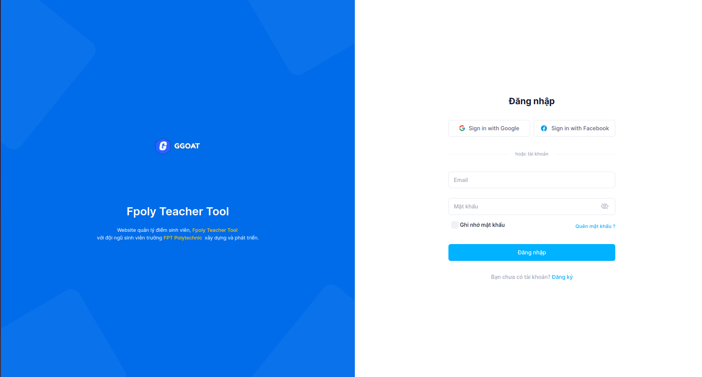
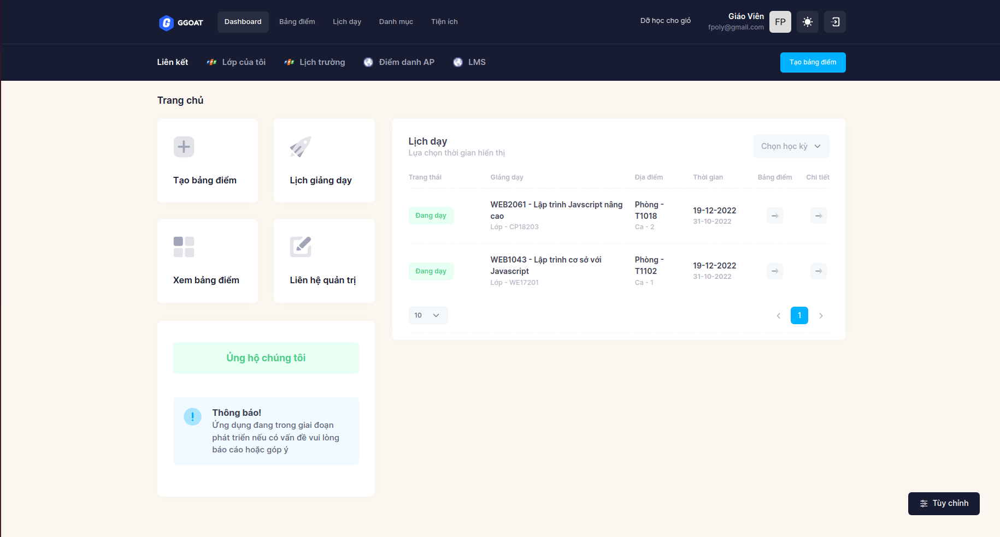
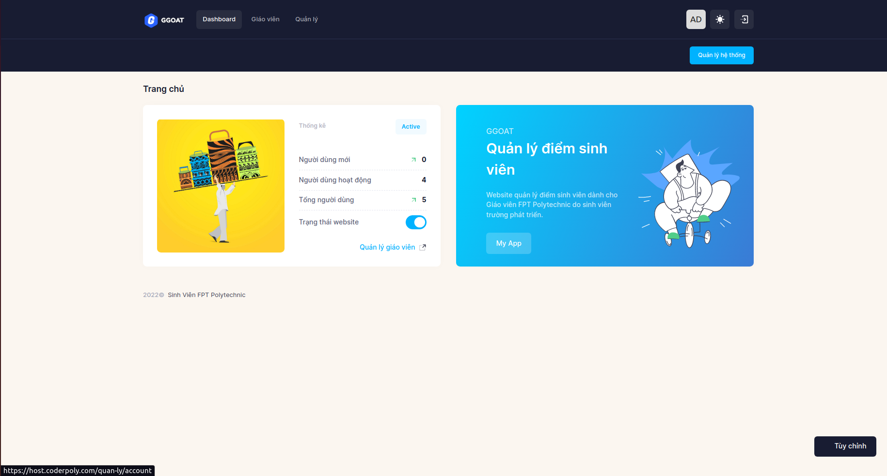

# Student score management website for teachers FPT Polytechnic

## Auth preview

# App preview

## Admin preview

## Getting started

- composer install

- composer require google/apiclient:^2.12.1

- composer dump-autoload

## Setup Database:

- Get file -> [database.sql](./documents/database.sql)

## Account test

1. CLIENT:

- email: fpoly@gmail.com
- password: Fpoly@gmail.com

2. ADMIN:

- email: fpolyteachertool@gmail.com
- password: Fpoly@gmail.com

## Document:

- Get file -> [database.sql](./documents/database.sql)
